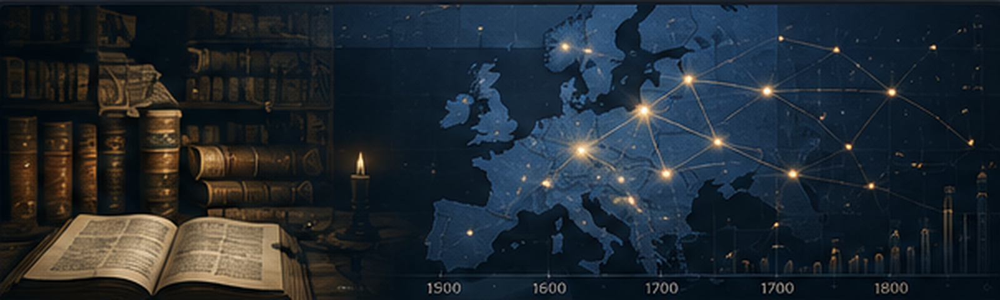

{.post-cover fig-alt="Historical books connected through a bibliographic data network across Europe"}

The transformation of European book culture between 1500 and 1800 offers a remarkable window into the evolution of knowledge, language, and public discourse. Research in **bibliographic data science** has shown how large-scale library catalogues and national bibliographies can be treated not only as tools for locating books, but also as datasets for studying long-term transformations in publishing and knowledge production [\[1\]](#ref1) [\[2\]](#ref2).

At the heart of this work lies the use of reproducible, quantitative methods to analyse historical publishing through bibliographic metadata. Large-scale studies have combined records from the Finnish and Swedish national bibliographies, the English Short-Title Catalogue (ESTC), and the Heritage of the Printed Book Database (HPB), creating an empirical foundation for comparative research on European print culture [\[1\]](#ref1).

The scale and heterogeneity of these collections require careful metadata harmonisation. Publication places, languages, dates, document formats, authorship information, and other fields may be recorded differently across catalogues and historical periods. Data cleaning, enrichment, quality assessment, and transparent documentation are therefore essential before statistical conclusions can be drawn [\[1\]](#ref1) [\[3\]](#ref3).

Once harmonised, these sources can help researchers investigate the geographical spread of publishing centres, changes in vernacular languages, shifts in book formats, and other aspects of printed material. These analyses illustrate how computational methods can complement traditional book-historical scholarship rather than replace close historical interpretation [\[1\]](#ref1).

A particularly interesting example is the development of printing in Sweden and Finland. Finland's first printing press began operating in **Turku in 1642**, shortly after the foundation of the Royal Academy of Turku in 1640 [\[4\]](#ref4). Quantitative analysis of the national bibliographies of Finland and Sweden shows that printing developed unevenly across the Swedish realm and was influenced by political events, regional differences, universities, and competing centres of intellectual activity [\[2\]](#ref2).

Book format also provides evidence of broader changes in print culture. Studies of bibliographic metadata identify the growing role of smaller formats such as **octavo** during the eighteenth century, alongside changes in the genres and circulation of printed material [\[1\]](#ref1) [\[2\]](#ref2).

These developments unfolded alongside political and cultural transformations. One important example was Sweden's **Freedom of the Press Act of 1766**, a landmark in the history of freedom of expression and access to public information [\[5\]](#ref5).

Beyond quantifying publication trends, bibliographic data science also exposes structural challenges in the bibliographical landscape. National and institutional bibliographies were created at different times for different purposes and often use differing cataloguing standards, classifications, languages, and levels of description. Apparent historical patterns can therefore sometimes reflect catalogue construction or missing metadata rather than historical reality. Reproducibility, source criticism, data-quality assessment, and transparent documentation are central methodological requirements [\[1\]](#ref1) [\[3\]](#ref3).

These challenges have motivated international collaboration. The **DARIAH-EU Bibliographical Data Working Group (BiblioData WG)** brings together researchers, bibliographic data providers, cultural-heritage organisations, and infrastructure specialists interested in improving the creation, curation, interoperability, and research use of bibliographic data [\[6\]](#ref6).

Large-scale quantitative analysis does not replace qualitative scholarship. Instead, it can provide new evidence, identify patterns worth investigating, test historical assumptions, and reveal developments that may be difficult to observe through individual sources alone [\[1\]](#ref1) [\[2\]](#ref2) [\[3\]](#ref3).

For readers interested in this area, the **Helsinki Computational History Group** provides further examples of computational approaches to book history, public discourse, bibliographic metadata, and historical cultural data [\[7\]](#ref7).

## References

**\[1\]** Lahti, L., Marjanen, J. P., Roivainen, H. H. M., & Tolonen, M. S. (2019). Bibliographic Data Science and the History of the Book (c. 1500–1800). *Cataloging & Classification Quarterly, 57*(1), 5–23. https://doi.org/10.1080/01639374.2018.1543747

**\[2\]** Tolonen, M., Lahti, L., Roivainen, H., & Marjanen, J. (2019). A Quantitative Approach to Book-Printing in Sweden and Finland, 1640–1828. *Historical Methods: A Journal of Quantitative and Interdisciplinary History, 52*(1), 57–78. https://doi.org/10.1080/01615440.2018.1526657

**\[3\]** Lahti, L., Vaara, V., Marjanen, J., & Tolonen, M. (2019). Best practices in bibliographic data science. In *Proceedings of the Research Data and Humanities (RDHUM) 2019 Conference: Data, Methods and Tools* (pp. 57–65). University of Oulu.

**\[4\]** Universal Short Title Catalogue. *Full Coverage of Finnish Printing, 1642–1650 Added*. University of St Andrews. https://www.ustc.ac.uk/news/full-coverage-of-finnish-printing-1642-1650-added

**\[5\]** Government Offices of Sweden. (2016). *Freedom of the Press: 250th Anniversary of the Swedish Freedom of the Press Act*. https://www.government.se/articles/2016/12/freedom-of-the-press-lars-danielsson-on-the-250th-anniversary/

**\[6\]** Łubocki, J. M., Herden, E., & Siwecka, D. (2021). Activities and projects of the Bibliographical Data Working Group (DARIAH-EU). *Bibliosphere*, 2, 103–107. https://doi.org/10.20913/1815-3186-2021-2-103-107

**\[7\]** Helsinki Computational History Group. *Research outputs and publications*. University of Helsinki. https://researchportal.helsinki.fi/en/projects/helsinki-computational-history-group/publications/
