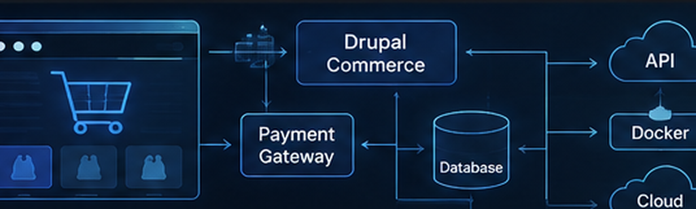

{.post-cover fig-alt="eCommerce architecture connecting a storefront to Drupal Commerce, payments, database, API, Docker, and cloud services"}

In today's digital economy, an effective eCommerce platform needs to balance usability, maintainability, security, performance, and the ability to evolve as business requirements change. This project focuses on building an end-to-end eCommerce solution using open-source technologies, with **Drupal Commerce** providing the central commerce framework [\[1\]](#ref1).

Drupal Commerce is designed as an extensible eCommerce framework built on Drupal. It provides core functionality for products, carts, checkout, customers, orders, payments, pricing, promotions, and stores, while allowing developers to extend these components for different business requirements [\[1\]](#ref1).

## Why This Project?

Rather than building a storefront as a collection of isolated features, the goal is to establish a flexible technical foundation that can support both current requirements and future development.

The project is designed to:

- Provide a flexible and customizable online storefront
- Integrate payment gateways using Drupal Commerce's extensible payment architecture [\[2\]](#ref2)
- Support product catalogues, orders, checkout processes, and customer accounts [\[1\]](#ref1)
- Generate readable and structured URLs using Drupal's Pathauto functionality [\[3\]](#ref3)
- Provide a responsive experience across desktop and mobile devices [\[4\]](#ref4)
- Lay the groundwork for analytics, marketing integrations, multilingual content, and additional commerce functionality

Drupal Commerce is particularly useful for this approach because it provides foundational commerce components without forcing every project into the same store structure [\[1\]](#ref1).

## The Tech Stack

### Key Technologies

- **Drupal Commerce** — provides the central commerce architecture, including products, carts, checkout, orders, payments, customers, pricing, and promotions [\[1\]](#ref1).
- **Pathauto & URL Aliases** — automatically creates human-readable URL aliases based on configurable patterns [\[3\]](#ref3). Google also recommends simple, descriptive URL structures where possible [\[5\]](#ref5).
- **Custom Backend Features** — Drupal Commerce can be extended through Drupal modules, configuration, events, entities, and custom code [\[1\]](#ref1).
- **Payment Gateway Integration** — Drupal Commerce provides a pluggable payment-gateway architecture supporting different providers and payment flows [\[2\]](#ref2).
- **Responsive Frontend** — Google recommends responsive web design as a maintainable approach for serving content across screen sizes [\[4\]](#ref4).

### Development Practices

- **Version control with Git** — supports distributed version control, project history, and collaborative development [\[6\]](#ref6).
- **Automated deployments** — reduce repetitive manual release steps and improve consistency across environments.
- **Containerization with Docker** — packages applications and dependencies into isolated, portable environments [\[7\]](#ref7).
- **Modular code structure** — allows functionality to evolve without rebuilding the entire application [\[1\]](#ref1).

## Progress So Far

Completed milestones include:

- Drupal Commerce setup and configuration
- Product catalogue structure established
- URL aliases generated for products, stores, and important content
- Administrative workflows configured for store management
- Local development and testing environments established

### Next Steps

- Frontend polishing for a branded and intuitive storefront
- Extending order-processing and payment functionality
- Adding analytics and performance monitoring
- Strengthening application security and GDPR-related practices

Performance can be evaluated using modern web-performance indicators such as Google's **Core Web Vitals**, which measure loading performance, responsiveness, and visual stability [\[8\]](#ref8).

Security should also be treated as an ongoing development process. The **OWASP Top 10** provides a widely used starting point for understanding major web-application security risks [\[9\]](#ref9), while Drupal maintains a formal security-advisory process for vulnerabilities affecting the ecosystem [\[10\]](#ref10).

## Privacy and GDPR

Because an eCommerce platform may process customer information such as names, addresses, account details, and order information, privacy must be considered throughout the system design.

Under the EU General Data Protection Regulation (GDPR), organisations processing personal data must follow principles including lawfulness, fairness and transparency, purpose limitation, data minimisation, accuracy, storage limitation, integrity and confidentiality, and accountability [\[11\]](#ref11).

Future analytics, customer-management, marketing, and personalization features should therefore be designed with privacy considerations from the beginning rather than added only after production deployment.

## Looking Ahead

The architecture is intended to provide a foundation for capabilities such as:

- Personalized shopping experiences
- Marketing and customer-management integrations
- Analytics and performance monitoring
- Social sharing and community engagement
- Multilingual storefronts
- Additional payment and fulfilment options
- Scalable infrastructure for future growth

Drupal Commerce's flexible architecture is useful here because commerce functionality can be combined with Drupal's broader content-management capabilities and extended with project-specific modules and third-party services [\[1\]](#ref1).

## Final Thoughts

Building an eCommerce system involves much more than creating product pages and connecting a payment provider. Architecture, maintainability, security, privacy, performance, responsive design, deployment, and data management all influence whether a platform remains useful as requirements evolve.

By combining Drupal Commerce with structured URL management, Git-based development, Docker-based environments, responsive design, security practices, and privacy-aware development, this project establishes a foundation that can be expanded incrementally rather than repeatedly rebuilt [\[1\]](#ref1) [\[5\]](#ref5) [\[7\]](#ref7) [\[9\]](#ref9).

## References

**\[1\]** Drupal Commerce. *Drupal Commerce Documentation*. https://docs.drupalcommerce.org/

**\[2\]** Drupal Commerce. *Payments and Payment Gateways*. Drupal Commerce Developer Guide. https://docs.drupalcommerce.org/

**\[3\]** Drupal Association. *Pathauto*. Drupal.org. https://www.drupal.org/project/pathauto

**\[4\]** Google Search Central. *Mobile-first indexing best practices*. https://developers.google.com/search/docs/crawling-indexing/mobile/mobile-sites-mobile-first-indexing

**\[5\]** Google Search Central. *URL structure best practices for Google Search*. https://developers.google.com/search/docs/crawling-indexing/url-structure

**\[6\]** Chacon, S., & Straub, B. *Pro Git*. Git Project. https://git-scm.com/book/en/v2

**\[7\]** Docker. *Docker overview*. Docker Documentation. https://docs.docker.com/get-started/docker-overview/

**\[8\]** Google Search Central. *Understanding Core Web Vitals and Google search results*. https://developers.google.com/search/docs/appearance/core-web-vitals

**\[9\]** OWASP Foundation. *OWASP Top 10*. https://owasp.org/www-project-top-ten/

**\[10\]** Drupal Security Team. *Security advisories*. Drupal.org. https://www.drupal.org/security

**\[11\]** European Commission. *What data can we process and under which conditions?* https://commission.europa.eu/law/law-topic/data-protection/rules-business-and-organisations/principles-gdpr_en
